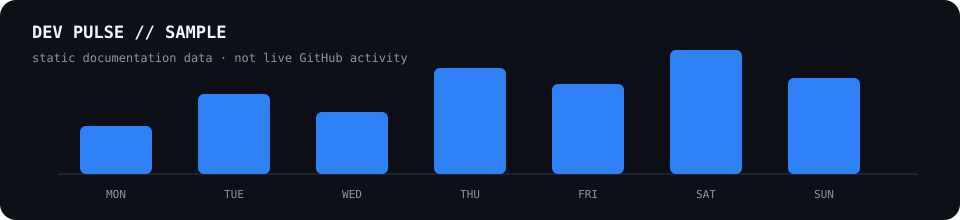

# Profile Signal — Sample Profile

> **Sample output only.** The values below are static demo data and are not fetched from a real GitHub account.

  <strong>Public GitHub activity → a compact development dashboard</strong> 
  Example generated with the <code>full</code> preset and <code>signal</code> theme.

---

<!-- PROFILE-SIGNAL:LIVE-SIGNAL:START -->
## LIVE SIGNAL // Development status

<table>
  <tr>
    <td width="33%" align="center"><strong>● BUILDING</strong> last public activity · 10:24 JST</td>
    <td width="34%" align="center"><strong>⚡ HEAVY CODING</strong> 27 public actions today</td>
    <td width="33%" align="center"><strong>🔥 6 DAY STREAK</strong> public GitHub activity</td>
  </tr>
</table>
<!-- PROFILE-SIGNAL:LIVE-SIGNAL:END -->

<!-- DAILY-ACTIVITY:START -->
## TODAY // Activity overview

sample day · public GitHub activity

<table>
  <tr>
    <td width="25%" align="center"><strong>18</strong> COMMITS</td>
    <td width="25%" align="center"><strong>4</strong> PRS OPENED</td>
    <td width="25%" align="center"><strong>2</strong> ISSUES CREATED</td>
    <td width="25%" align="center"><strong>3</strong> ISSUES DONE</td>
  </tr>
</table>
<!-- DAILY-ACTIVITY:END -->

<!-- PROFILE-SIGNAL:FOCUS:START -->
## CURRENT FOCUS // What is moving now

<table>
  <tr>
    <td width="62%" valign="top"><strong>sample-user/web-app</strong> weighted activity 42% · score 29 · 11 events</td>
    <td width="38%" valign="top"><strong>CURRENT STACK</strong> TypeScript · React · PostgreSQL</td>
  </tr>
</table>
<!-- PROFILE-SIGNAL:FOCUS:END -->

<!-- PROFILE-SIGNAL:PULSE:START -->
## DEV PULSE // Last 7 days

  

### QUALITY SIGNAL // Last 7 days

<table>
  <tr>
    <td width="25%" align="center"><strong>HEALTHY</strong> CI SIGNAL</td>
    <td width="25%" align="center"><strong>92%</strong> PASS RATE</td>
    <td width="25%" align="center"><strong>22 / 24</strong> PASSED / EVALUATED</td>
    <td width="25%" align="center"><strong>3</strong> REPOS WITH CI</td>
  </tr>
</table>
<!-- PROFILE-SIGNAL:PULSE:END -->

<!-- PROFILE-SIGNAL:NOW-BUILDING:START -->
## NOW BUILDING // Active repositories

<table>
  <tr>
    <td width="33%" valign="top"><strong>01 · sample-user/web-app</strong> 42% weighted · HEALTHY · CI pass rate 100% last activity · 10:24 JST</td>
    <td width="33%" valign="top"><strong>02 · sample-user/cli-tool</strong> 31% weighted · HEALTHY · CI pass rate 90% last activity · 09:18 JST</td>
    <td width="33%" valign="top"><strong>03 · sample-user/api-service</strong> 18% weighted · WATCH · CI pass rate 80% last activity · 08:42 JST</td>
  </tr>
</table>
<!-- PROFILE-SIGNAL:NOW-BUILDING:END -->

<!-- PROFILE-SIGNAL:ACTIVITY-STREAM:START -->
## ACTIVITY STREAM // Latest public signals

<table>
  <tbody>
    <tr><td width="10%"><code>10:24</code></td><td width="14%"><code>MERGED</code></td><td><strong>sample-user/web-app</strong> — merged pull request #42</td></tr>
    <tr><td width="10%"><code>09:18</code></td><td width="14%"><code>PUSH</code></td><td><strong>sample-user/cli-tool</strong> — pushed 3 commits to main</td></tr>
    <tr><td width="10%"><code>08:42</code></td><td width="14%"><code>ISSUE</code></td><td><strong>sample-user/api-service</strong> — closed issue #18</td></tr>
    <tr><td width="10%"><code>07:55</code></td><td width="14%"><code>RELEASE</code></td><td><strong>sample-user/web-app</strong> — published v1.4.0</td></tr>
  </tbody>
</table>
<!-- PROFILE-SIGNAL:ACTIVITY-STREAM:END -->

<!-- PROFILE-SIGNAL:RECAP:START -->
## DEV RECAP // Tracked history

<table>
  <tr>
    <td width="25%" align="center"><strong>🔥 6</strong> DAY STREAK</td>
    <td width="25%" align="center"><strong>74</strong> COMMITS · THIS WEEK</td>
    <td width="25%" align="center"><strong>12</strong> PRS · THIS WEEK</td>
    <td width="25%" align="center"><strong>9</strong> ISSUES DONE · THIS WEEK</td>
  </tr>
</table>

<strong>MONTHLY BUILD REPORT + ACHIEVEMENTS</strong>

 
<table>
  <tr>
    <td width="25%" align="center"><strong>286</strong> COMMITS</td>
    <td width="25%" align="center"><strong>41</strong> PRS</td>
    <td width="25%" align="center"><strong>27</strong> ISSUES DONE</td>
    <td width="25%" align="center"><strong>362</strong> ACTIVITY</td>
  </tr>
</table>

Sample tracked history, not lifetime GitHub totals.

<!-- PROFILE-SIGNAL:RECAP:END -->

---

## What this sample represents

This page mirrors the Markdown/HTML structure generated by Profile Signal so the output can be reviewed without installing the runtime into a real profile repository first.

- No private repository data is used.
- No PAT or API key is required to view this sample.
- Values are intentionally static so screenshots and documentation stay deterministic.
- A real installation replaces these values from public GitHub activity.

[Back to Profile Signal](../../README.md) · [Installation](../../distribution/INSTALL.md) · [Releases](https://github.com/mizzz-ivr/profile-signal/releases)
